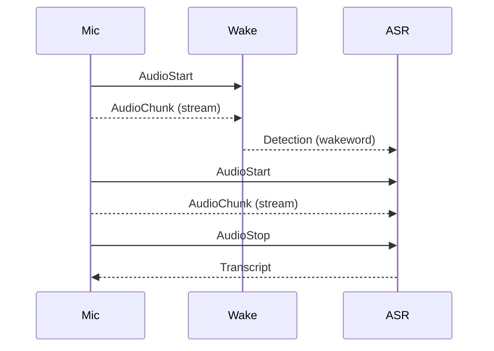

# 📜 Wyoming Protocol Specification

Wyoming is a binary-safe event protocol optimized for streaming. Each message consists of:

1. A single-line **JSON header**
2. Optional binary **data** (e.g. structured config)
3. Optional binary **payload** (e.g. audio stream)

---

## 🧱 Message Format

```
{ "type": "...", "data_length": ..., "payload_length": ... }\n
<data bytes> (optional)
<payload bytes> (optional)
```

- `type`: The event type (e.g. `audio-start`, `transcribe`)
- `data_length`: Length in bytes of optional metadata (JSON)
- `payload_length`: Length in bytes of binary payload

---

## 🗂️ Example: Audio Stream

```json
{ "type": "audio-chunk", "data_length": 0, "payload_length": 3200 }
```

Followed by 3200 bytes of PCM audio.

---

## 🎞️ Streaming Audio Flow (Mermaid)



---

## 📦 Message Lifecycle

Each Wyoming component speaks the same protocol. Typical flows include:

### ASR:

- `Transcribe` → `AudioStart` + `AudioChunk` + `AudioStop` → `Transcript`

### TTS:

- `Synthesize` → `AudioStart` + `AudioChunk` + `AudioStop`

### Wakeword:

- `Detect` → `AudioChunk*` → `Detection` or `NotDetected`

---

## 🔄 Streaming vs One-Shot

Unlike HTTP-based APIs, Wyoming supports **true streaming**:

- Send audio while it’s being recorded
- Receive results as they become available
- Enables real-time voice interaction

---

## 🛑 Error Handling

Errors are returned as `Error` events:

```json
{ "type": "error", "data": { "message": "Invalid audio format" } }
```

Clients should handle unknown types gracefully and support reconnecting to services.

---

## 🔄 Compatibility

- All messages are newline-delimited JSON
- Binary segments follow directly after header
- Works across languages and platforms

