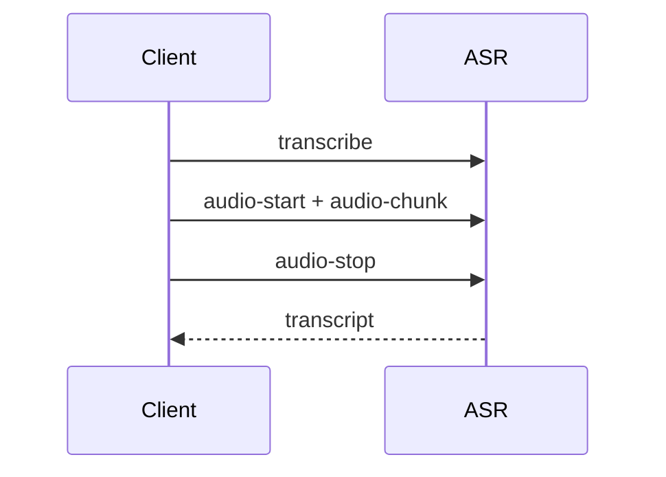

# 📘 Section 05 – Wyoming API Reference (Summary)

This section provides an in-depth reference to the **Wyoming protocol and its Python implementation**. The Wyoming protocol is designed for lightweight, streaming-based communication between voice services like ASR, TTS, Wakeword, and Timers.

---

## 📦 Protocol Format

- Wyoming uses a **newline-delimited JSON header** + optional UTF-8 metadata + optional binary payload (PCM audio).
- Works over **TCP**, **Unix sockets**, or **stdio**.
- Each event includes:
  - `type` – string identifier (e.g., `transcribe`)
  - `data_length`, `payload_length` – optional sizes for metadata/audio

Python example:

```python
from wyoming.event import Event

event = Event(type="synthesize", data={"text": "Hello"}, payload=b"")
```

---

## 🔢 Standard Event Types

| Category   | Events |
|------------|--------|
| Audio      | `audio-start`, `audio-chunk`, `audio-stop` |
| ASR        | `transcribe`, `transcript` |
| TTS        | `synthesize` |
| Wakeword   | `detect`, `detection`, `not-detected` |
| VAD        | `voice-started`, `voice-stopped` |
| Intent     | `recognize`, `intent`, `not-recognized` |
| Handling   | `handled`, `not-handled` |
| Info       | `describe`, `info` |
| Timer ⏱️    | `timer-started`, `timer-updated`, `timer-cancelled`, `timer-finished` |
| Satellite  | `run-pipeline`, `satellite-connected`, etc. |

---

## 🐍 Python Modules

### `wyoming.event`
Serialize/deserialize events:

```python
from wyoming.event import read_event, write_event
```

### `wyoming.client`
Async client to any Wyoming service:

```python
from wyoming.client import AsyncClient
```

### `wyoming.server`
Build Wyoming-compatible TCP/Unix servers:

```python
from wyoming.server import serve_forever, AsyncEventHandler
```

### `wyoming.audio`, `wyoming.asr`, `wyoming.tts`, etc.
Domain-specific types with `.event()` and `.from_event()` helpers.

---

## ⏱️ Timer Event Highlights

Timer example: 10-minute kitchen timer

```json
{
  "type": "timer-started",
  "data": {
    "id": "kitchen",
    "total_seconds": 600,
    "start_minutes": 10
  }
}
```

Python:

```python
from wyoming.timer import TimerStarted

TimerStarted(id="kitchen", total_seconds=600).event()
```

---

## 🔁 Sequence Diagrams (Mermaid)

### Speech to Text



### Timer Flow

```mermaid
sequenceDiagram
User->>ASR->>Intent->>Handler->>Timer
Timer-->>Handler: timer-confirmation
```

More flows available in `diagrams.md`.

---

## 📌 Summary

- Use `describe` → `info` to detect service capabilities
- All services follow `event -> response` model
- Python dataclasses are mapped 1:1 to Wyoming messages
- Modular architecture lets you combine components freely

