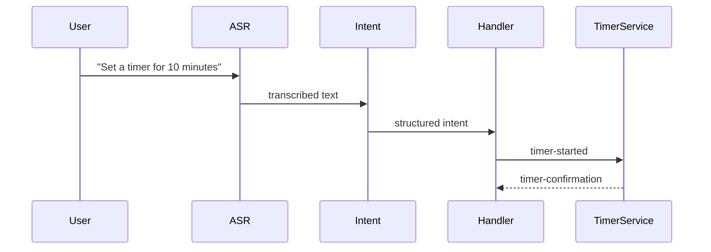

# ⏱️ Timer Events in Wyoming

Wyoming defines a set of event types for managing timers, like in smart speakers:

> “Set a timer for 10 minutes”  
> “Pause all timers”  
> “Cancel the pizza timer”

These events are intended to be interpreted by timer-capable services.

---

## 📦 `timer-started`

Sent when a new timer begins.

```json
{
  "type": "timer-started",
  "data": {
    "id": "abc123",
    "total_seconds": 600,
    "name": "pizza",
    "start_minutes": 10
  }
}
```

Optional: include `command` to trigger when timer ends.

```json
"command": {
  "text": "turn off oven",
  "language": "en"
}
```

---

## 🔁 `timer-updated`

Sent when a timer is paused, resumed, or adjusted.

```json
{
  "type": "timer-updated",
  "data": {
    "id": "abc123",
    "is_active": false,
    "total_seconds": 300
  }
}
```

---

## ❌ `timer-cancelled`

Sent when a timer is explicitly stopped.

```json
{ "type": "timer-cancelled", "data": { "id": "abc123" } }
```

---

## ✅ `timer-finished`

Sent when timer reaches 0.

```json
{ "type": "timer-finished", "data": { "id": "abc123" } }
```

---

## 🧪 Python Example: Create Timer Event

```python
from wyoming.timer import TimerStarted

event = TimerStarted(
    id="kitchen-timer",
    total_seconds=600,
    name="kitchen",
    start_minutes=10
).event()
```

---

## 🧪 Timer Flow Diagram



---

## 🧠 How to Use

- Only send one `timer-started` per timer
- Timers should be referenced by their `id`
- Timer services must handle multiple timers simultaneously
- Use `timer-finished` to notify user or trigger events

---

## 💡 Use Cases

- Cooking timers
- Study or break reminders
- Custom automation triggers

