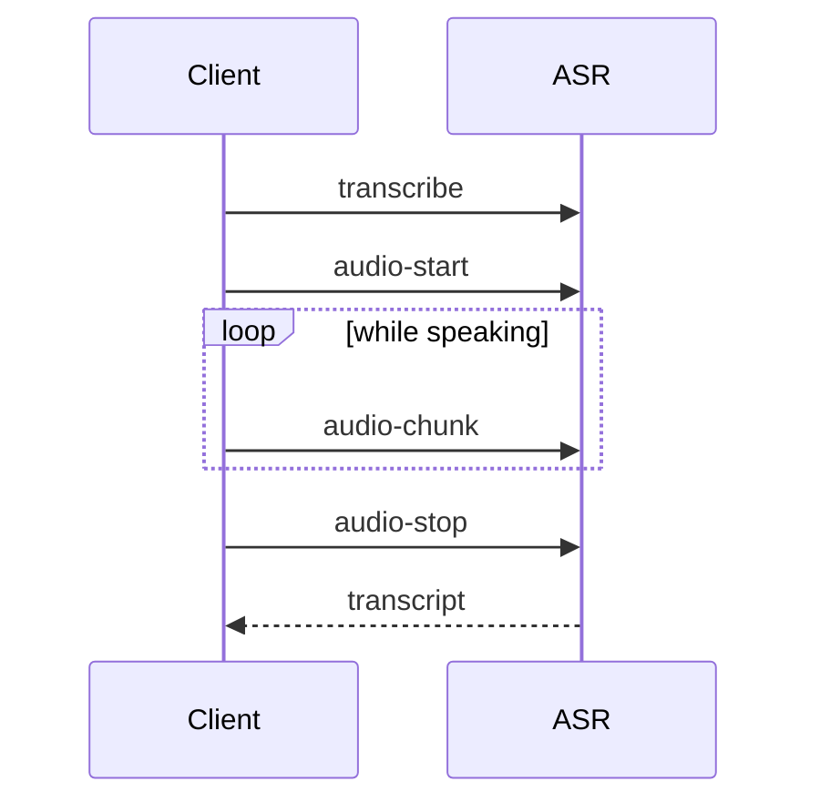
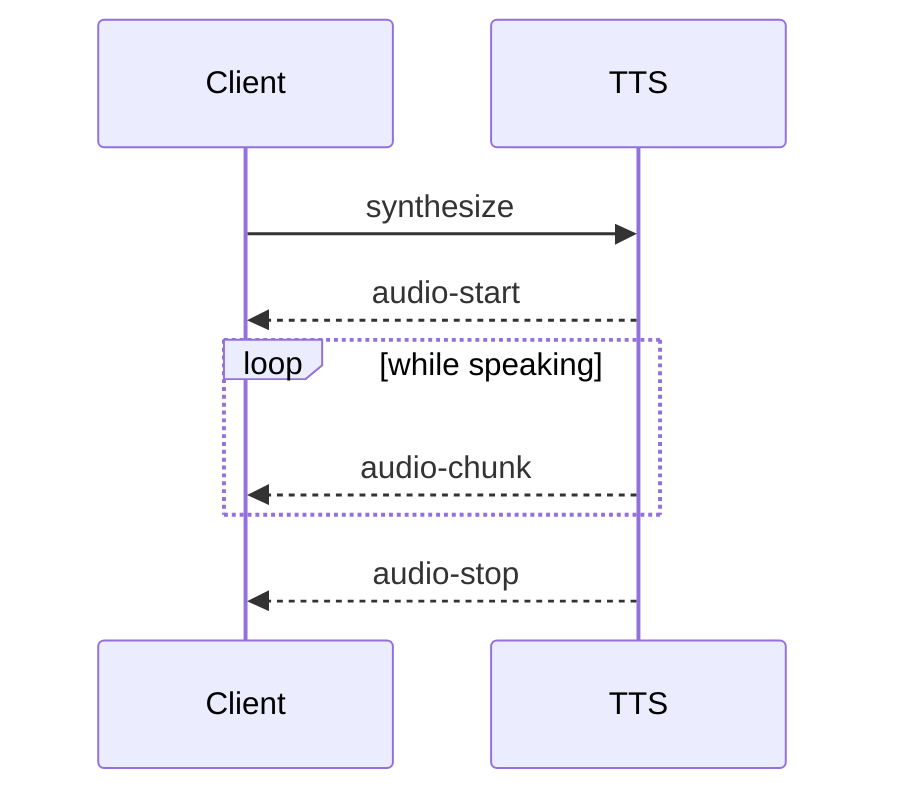
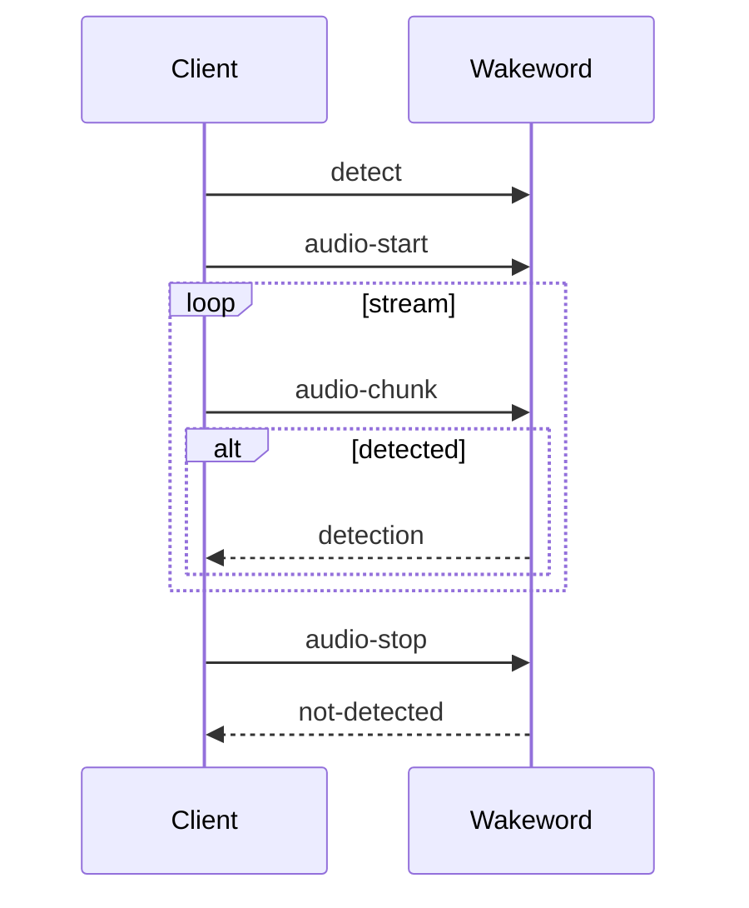
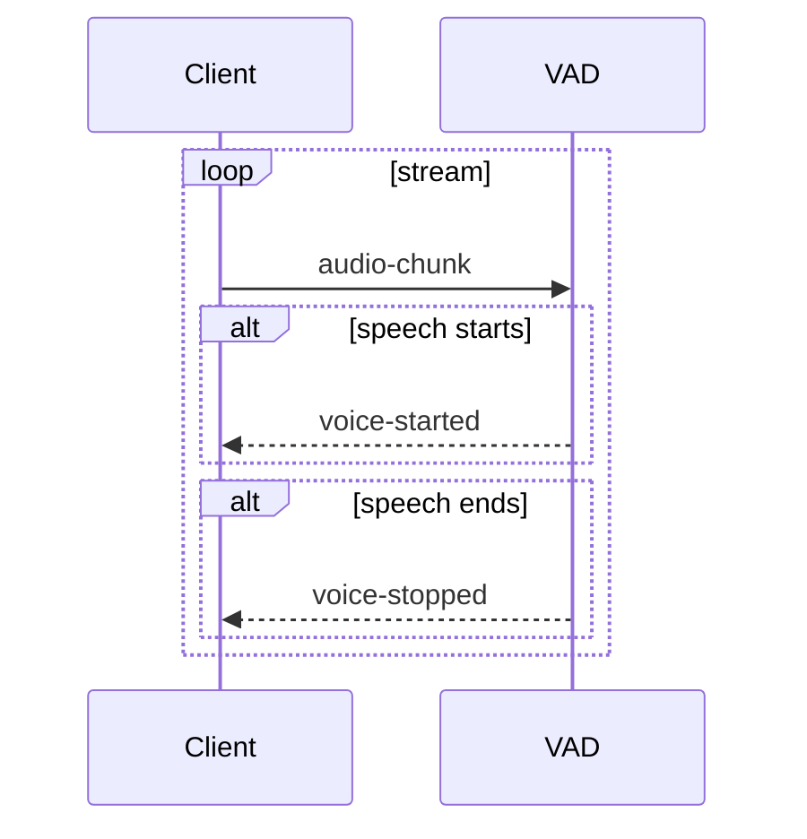
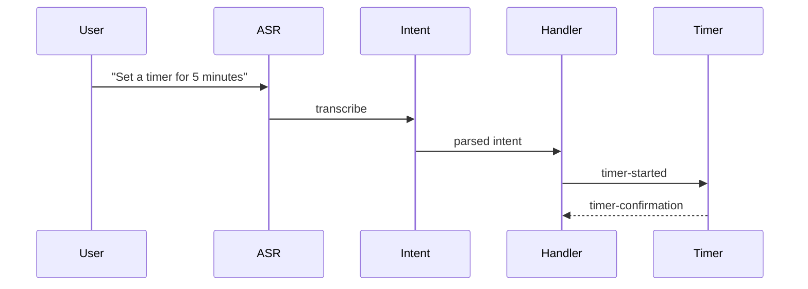
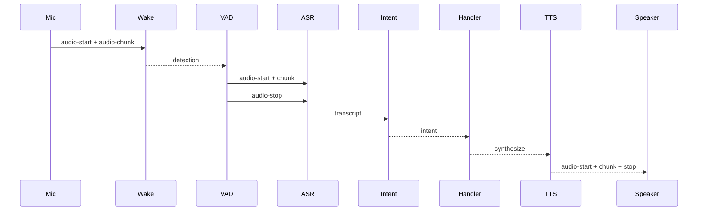

# 🔁 Event Flow Diagrams

This section visualizes the communication between Wyoming components using **Mermaid sequence diagrams**.

---

## 🎙️ Speech-to-Text (ASR)

---

## 🗣️ Text-to-Speech (TTS)

---

## 🚨 Wake Word Detection

---

## 🎧 Voice Activity Detection

---

## ⏱️ Timer Pipeline

---

## 🔁 Full Pipeline Flow

---

## 🧠 Notes

- Event streams are **asynchronous** and **bidirectional**
- All diagrams assume persistent socket connections (no HTTP overhead)
- Services must send `describe`/`info` to negotiate capabilities

